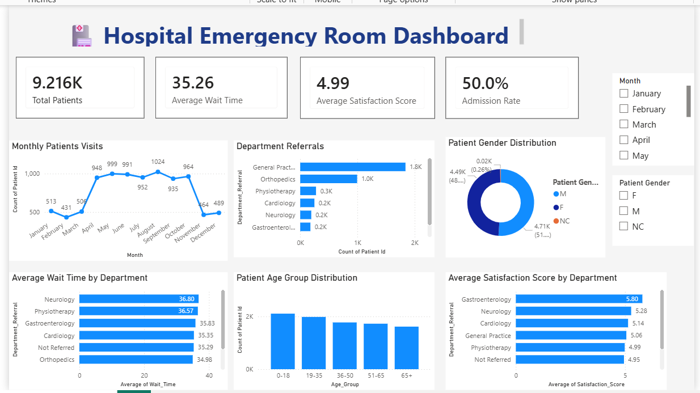

# 🏥 Hospital Emergency Room Analysis Dashboard
Interactive Hospital Emergency Room dashboard built using **Python (EDA)** and **Power BI** to analyze patient visits, wait times, admissions, department referrals, and patient satisfaction.

## 📌 Overview
This project focuses on analyzing Hospital Emergency Room (ER) data using Python for data cleaning and Exploratory Data Analysis (EDA), followed by Power BI to create an interactive dashboard. The goal is to transform raw healthcare data into meaningful insights that support hospital performance monitoring and decision-making.

## 📂 Repository Contents
📓 **Hospital_EDA.ipynb** → Data Cleaning & Exploratory Data Analysis (Python)
📊 **Hospital_ER_Dashboard.pbix** → Interactive Power BI Dashboard
📄 **Hospital_ER_Data.csv** → Raw Dataset
🖼️ **Dashboard.png** → Dashboard Preview
📘 **README.md** → Project Documentation

## 🎯 Project Objectives
- Analyze patient admission trends and emergency room visits.
- Monitor average patient wait times.
- Evaluate department referral patterns.
- Analyze patient satisfaction scores.
- Build an interactive dashboard for hospital performance monitoring.

## 🛠️ Tools & Technologies
- 🐍 Python (Pandas, NumPy)
- 📊 Matplotlib & Seaborn
- 📘 Jupyter Notebook
- 📈 Power BI
- ⚡ Power Query
- 📊 DAX Measures & Interactive Visualizations
- 
## 💡 Data Analysis & Business Intelligence
- Performed data cleaning and preprocessing using Python.
- Conducted Exploratory Data Analysis (EDA) to identify trends and patterns.
- Created new features such as Month and Age Group.
- Built interactive KPIs and charts in Power BI.
- Designed a dashboard to support healthcare performance analysis.

## 📊 Dashboard Highlights
- 👥 Total Patients
- 🏥 Admission Rate
- ⏱️ Average Wait Time
- ⭐ Average Satisfaction Score
- 📈 Monthly Patient Visits
- 📊 Department Referral Analysis
- 👥 Patient Age Group Distribution
- 🚻 Gender Distribution
- ⏱️ Average Wait Time by Department
- ⭐ Satisfaction Score by Department

## 🖼️ Dashboard Preview
### Hospital Emergency Room Dashboard

## 🚀 Key Insights
- Analyzed **9,216 patient records**.
- Average patient wait time is approximately **35 minutes**.
- General Practice receives the highest number of referrals.
- Adults aged **19–35** account for the largest share of patients.
- Patient satisfaction varies across hospital departments.
- Monthly patient visits fluctuate throughout the year.

## 👤 Author
**Sara**
💼 Aspiring Data Analyst | B.Tech (Artificial Intelligence & Data Science)

## ⭐ Support
If you found this project helpful, feel free to:
⭐ Star this repository
📢 Share it with others
